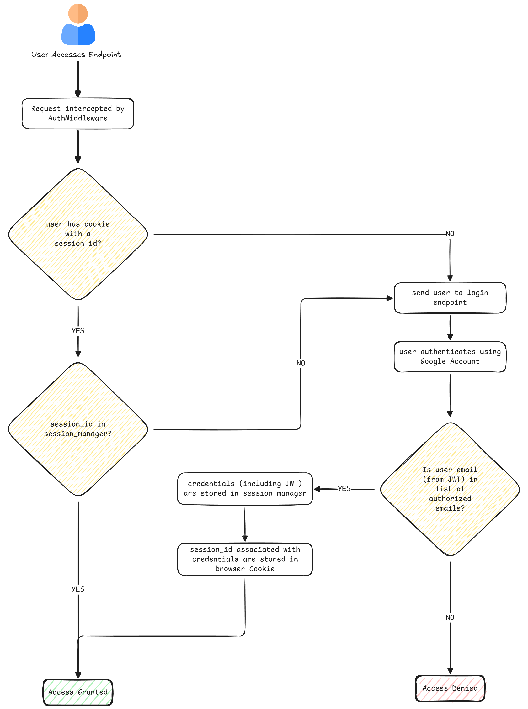

# Authentication & Authorization
This application uses the Google oauth2.0 client to authenticate users with a google account. As this is a hobby project, the authorization is a simple check to see if the google account's email address (retrieved from the JWT) is an authorized user.

## Flow

## Folder Structure
Inside of the backend code all of the logic pertaining to authentication & authorization is located inside of the `backend/src/auth` directory.

| File | Description |
|------|-------------|
| `__init__.py` | Turns the auth directory in a module and defines what can be imported from said module |
| `middleware.py` | Contains a FastAPI Middleware class to check if a user is authenticated with each request that is made to the backend. If the user is not authenticated they are redirected to the login endpoint (see `router.py`) |
| `oauth.py` | Contains the OAuth2.0 flow specifically for the Google client |
| `router.py` | Defines the authentication FastAPI endpoints (i.e. login, callback, logout), the user will be redirected to these through the `AuthMiddleware` (see `middleware.py`) |
| `session_manager.py` | Contains a class to manage sessions. Each session is a user's OAuth credentials as a dictionary object. This dictionary contains everything related to Google's OAuth credentials, including JWT Tokens. This could have been implemented as a simple dictionary, but this class implementation leaves room for additional functionality to be added later. |
